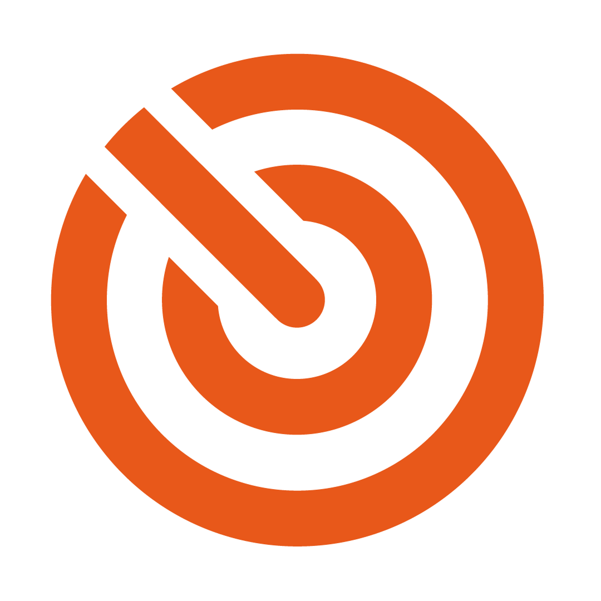
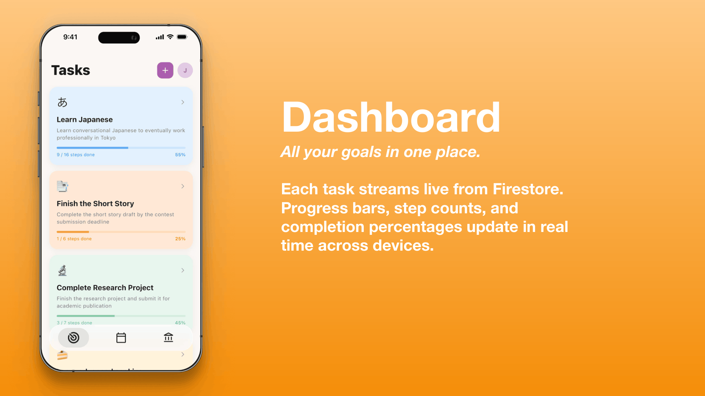
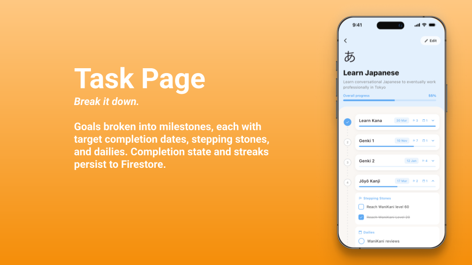
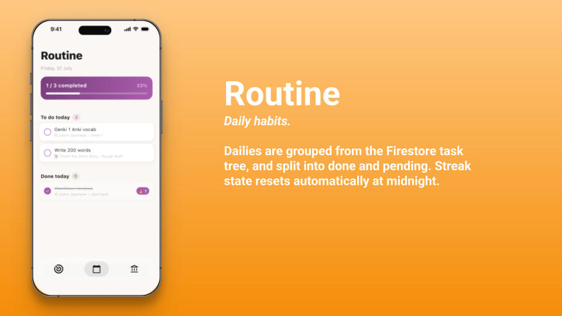
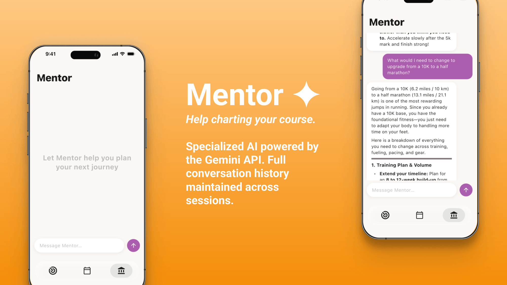
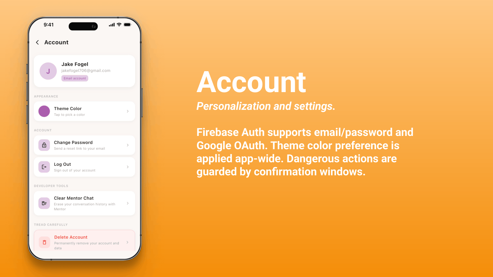

  
  <h1 align="center">Odyssey</h1>
  
<em>Goal Tracking Made Intuitive</em>

---

Odyssey is a mobile app designed to help users achieve their goals. Instead of flat to-do lists, Odyssey creates hierarchy of progress: goals break into milestones, milestones into stepping stones and daily habits, and daily habits into streaks. Whether you're learning a language, finishing a research paper, or writing a short story, Odyssey gives you a clear map and keeps you moving towards your goal.

---
 
## Features
 

 
---

## Tech Stack

| Layer | Technology |
|---|---|
| Framework | Flutter (Dart) |
| Auth | Firebase Authentication |
| Database | Cloud Firestore |
| AI | Google Gemini API |
| State | Provider (`ChangeNotifier`) |
| Platform | iOS |

---

## Author

**Jake Fogel**  
MS Computer Science — NYU Tandon

[linkedin.com/in/jakefogel/](https://linkedin.com/in/jakefogel/) | jakefogel@rogers.com
